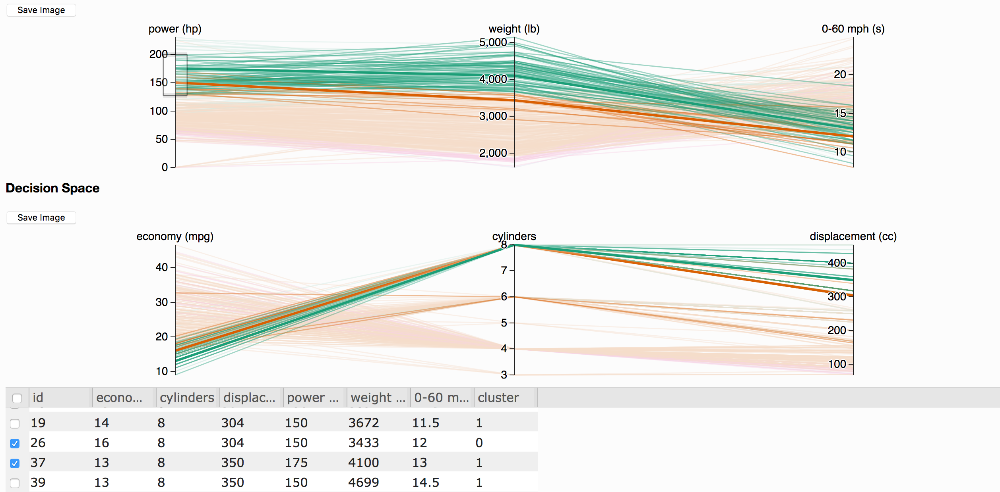

# From interactive visualization web-application to JavaScript library: a roadmap for parasol.js

Produced by:
Kasprzyk Research Group
Civil, Environmental and Architectural Engineering Dept.
University of Colorado Boulder
**[josephkasprzyk.wordpress.com](https://josephkasprzyk.wordpress.com/group)**

Last updated: May 8, 2018

# Table of contents
- [Introduction](#introduction)
- [Features](#features)
    - [Import data](#import)
    - [K-means clustering](#clustering)
    - [Linked brushing](#brushing)
      - [Reset brushes](#brush-reset)
    - [Marking](#marking)
      - [Clear markings](#clear-markings)
    - [Reorderable axes](#reorder-axes)
    - [Hide and show axes](#hide-show)
    - [Set axes limits](#axes-limits)
    - [Keep and Remove selection](#keep-remove)
    - [Export selection as csv](#export)
    - [Explore selection](#explore)
- [Discussion](#discussion)

## Introduction <a name="introduction"></a>

_parasol_ is a new tool providing interactive visualization and statistical analysis methods for multiobjective optimization problems. _parasol_ is built on D3.js, a JavaScript library for data-driven documents, and the associated parallel coordinates library, d3.parcoords.js. This document describes the current state of _parasol_ as a web-application and provides a comprehensive outline of the mechanics of each feature, including an overview of all associated code and intended functionality.

As a web-application, _parasol_ serves as an approachable and streamlined tool for decision makers to explore many-objective optimizations. However, as a Javascript library, _parasol_ could provide the same functionality in a more versatile manner. Therefore, in addition to describing the functionality of _parasol_, the relevance of each feature to a library implementation and potential course for transition are additionally addressed throughout.

## Features <a name="features"></a>

### Import data <a name="import"></a>
Currently, only .csv file uploads are supported. In the future, this may extend to other file formats and database connections. Once the data has been uploaded, the uploader must be removed due to an issue with re-uploading data without reloading the webpage.

**Note:** If the user is building a personalized tool through the library, they will likely have a specific dataset to automatically import. In this case, functionality is already handled by `d3.csv`.

##### Current implementation details
The current csv uploader functions as a button and is the first thing the user sees when opening the app. They must click the button and select a csv file from their directory before the plots and grid can be produced. Once a file is selected, the app enters the `visualize` function which drives the interactive capabilities, and the uploader is removed.

```javascript
// create button
<input type="file" id="uploader">
```
```javascript
var uploader = document.getElementById("uploader");
var reader = new FileReader();

reader.onload = function(e) {
  var contents = e.target.result;
  var data = d3.csv.parse(contents);

  // visualize data with default to 3 clusters
  visualize(data, n_objs = 3, k = 4);

  // remove uploader button
  uploader.parentNode.removeChild(uploader);
};

uploader.addEventListener("change", handleFiles, false);

function handleFiles() {
  var file = this.files[0];
  reader.readAsText(file);
};
```

##### Proposed library API
This feature is relevant for a two main purposes. It is convenient for those who would like to test their code on multiple files without having to edit the file path, and to those using _parasol_ to develop a web application similar to what we have done here.

In the library, this should be a function that takes no argument, and simply appends the uploader button to the webpage.

```javascript
parasol.import()
```

### K-means clustering <a name="clustering"></a>
K-means clustering partitions the imported data into into k clusters in which each datapoint belongs to the cluster with the nearest mean. In this way, clustering groups the solutions by a measure of statistical similarity. These clusters are denoted by corresponding categorical colors depending on the number of clusters specified. The default value is set to 3 clusters, with a maximum value of 6 clusters. This cap is due in part to the loss of relevance with too many clusters, and to the limited number of catagorical colors in the "Dark2" color pallete. Of course, the latter can be easily remedied should we choose to increase the maximum number of clusters.

##### Current implementation details
Clustering is implemented using the _ML_ library.
```javascript
var kmeans = ML.Clust.kmeans;
```
In a library-like functionality, the web-app developer currently specifies the number of clusters in the call to the `visualize` function.
```javascript
visualize(data, n_objs = 3, k = 4);
```

The first task of the `visualize` function is to setup the clusters. We use the _Underscore_ library to obtain data in the necessary array format for the _ML_ library, preform clustering on the array version of the data, and append clusters id's to the original data.
```javascript
// max clusters = 6
k = (k <= 6) ?  k : 3;

// coerce data to array of arrays for clustering
var clust_form = [];
data.forEach(function(d,i) { clust_form[i] = _.values(d) });

// preform default clustering
var km = kmeans(clust_form, k);
data.forEach(function(d,i) { d.cluster = km.clusters[i]; });
```

We then define a color pallete based on the number of specified clusters.
```javascript
// choose default catagorical color scheme
var color_scheme = d3.scale.ordinal()
  .range(colorbrewer.Dark2[k])

var palette = function(d) {
  return color_scheme(d['cluster']);
};
```

This `palette` variable is then passed to the parallel coordinate plot variables, so that each observation will be colored by its cluster id. For example,
```javascript
// objective space
var pc1 = d3.parcoords()("#plot01")
  .data(data)
  .hideAxis(decision_vars)
  .color(palette)
```

In addition to representing clusters by color, users may also choose to view clusters on an axis for interactive [brushing](#brushing). Because clusters id's are associated with each row of data, an axis is automatically created for them when plotting. By default, the cluster axis is currently hidden to avoid repetetive display of data. However, using the [Hide and Show axes](#hide-show) feature, they can easily be revealed. See the images below for reference.

Default: Clusters hidden on import.


After cluster axis selected in [Hide and Show axes](#hide-show).


##### Proposed library API
Clustering functionality should be an extension of the main `visualize` function. The user will specify the following:
- k: number of clusters
- type: {"k-means", "spectral"} the type of clustering to be preformed
- group: {"decisions", "objectives", "both"} the group on which clusters will be decided

Defaults are listed below.

```javascript
visualize(data, num_objectives)
  .cluster(k = 3, type="k-means", group="both")
```

### Linked brushing <a name="brushing"></a>
Coming soon.

##### Current implementation details
##### Proposed library api

#### Reset brushes <a name="brush-reset"></a>
Coming soon.

##### Current implementation details
##### Proposed library api

### Marking <a name="markings"></a>
Marking is a key feature in many visualization tools. It allows the user to view individual solution data and permanently highlight solutions of interest. See the image below for an example.



##### Current implementation details
Marking is currently implemented under the terminology "selections." This is because, similar to brushed data, markings are handled in their own canvas layer. In the stock version of the _parallel-coordinates_ library, there already exits a _marks_ layer which may have been included with plans for this feature in mind. However, to avoid potential conflict, we have temporarily chosen to call this layer _selections_ as shown below. We will soon attempt to use the _marks_ layer alone however.

```javascript
var pc = function(selection) {
  selection = pc.selection = d3.select(selection);

  __.width = selection[0][0].clientWidth;
  __.height = selection[0][0].clientHeight;

  // canvas data layers
  ["marks", "foreground", "brushed", "highlight", "selections"]
  .forEach(function(layer) {
    canvas[layer] = selection
      .append("canvas")
      .attr("class", layer)[0][0];
    ctx[layer] = canvas[layer].getContext("2d");
  });

  // svg tick and brush layers
  pc.svg = selection
    .append("svg")
      .attr("width", __.width)
      .attr("height", __.height)
      .style("font", "14px sans-serif")
      .style("position", "absolute")

    .append("svg:g")
      .attr("transform", "translate(" + __.margin.left +
      "," + __.margin.top + ")");

  return pc;
};
```
The other key edit to the _parallel-coordinates_ library involves styling the _selections_ layer. In the CSS stylesheet, we add a _dimmed_ state to the canvas layer options as follows (file: d3.parcoords_ucb.css):
```javascript
/* custom "dimmed" class for selections layer */
.parcoords canvas.dimmed {
  opacity: 0.85;
}
```
This is applied to the foreground and brushed layers when selections exist to increase contrast between layers, making the selections more prominent. This design aspect is handled in the custom `select` and `deselect` functions we've added to the _parallel-coordinates_ library (file: d3.parcoords_ucb.js):
```javascript
// select an array of data
pc.select = function(data) {
  if (arguments.length === 0) {
    return __.selected;
  }

  // add row to already selected data
  __.selected = _.union( __.selected, data);
  data.forEach(path_selections);
  d3.selectAll([canvas.foreground, canvas.brushed]).classed("dimmed", true);
  return this;
};

// clear selections layer
pc.deselect = function() {
  __.selected = [];
  pc.clear("selections");
  d3.selectAll([canvas.foreground, canvas.brushed]).classed("dimmed", false);
  return this;
};
```

Wrapping this feature into _parasol_ involves a few more additions to the _parallel-coordinates_ library. These are listed below (file: parcoords_ucb.js):
- add the array element _selected_ to the `d3.parcoords` function
- add default styles to selections layer:
```javascript
ctx.selections.lineWidth = 3;
ctx.selections.shadowColor = "#ffffff";
ctx.selections.shadowBlur = 10;
ctx.selections.scale(devicePixelRatio, devicePixelRatio);
```
- create renderSelections function
```javascript
pc.renderSelections = function() {
  if (!d3.keys(__.dimensions).length) pc.detectDimensions();

  events.render.call(this);
  return this;
};
```
  - default
  ```javascript
  pc.renderSelections.default = function() {
    pc.clear('selections');

    if (__.selected.length) {
      __.selected.forEach(path_selections);
    }
  };
  ```
  - selectedQueue

    ```javascript
    var selectedQueue = d3.renderQueue(path_selections)
      .rate(50)
      .clear(function() {
        pc.clear('selections');
      })

    pc.renderSelections.queue = function() {
      if (__.selected.length) {
        selectedQueue(__.selected);
      } else {
        selectedQueue([]);
        // This is needed to clear the currently selected items
      }
    };
    ```
- path function
```javascript
function path_selections(d, i) {
  ctx.selections.strokeStyle = d3.functor(__.color)(d, i);
	return color_path(d, ctx.selections);
};
```

**Note:** The exact construction details of this functionality parallel the _highlighting_ feature, with the exception of the rendering component which parallels _brushing_. That is, for line-for-line implementation detail, simply search the terms "highlight" and "renderBrushed" in the parcoords_ucb.js file, and the additions for _selections_ can be found and traced in this way.

Now that we have added _selections_ capability to the _parallel-coordinates_ library, we can include this feature in _parasol_. A selection is made when the user clicks the checkbox for a row in the data grid. This calls the `pc.select' function which increases line thickness and contrast. In the future, we plan to give the user the freedom to assign a new color to the selection as well. We include this checkbox functionality as follows:
```javascript
var checkboxSelector = new Slick.CheckboxSelectColumn({
  cssClass: "slick-cell-checkboxsel"
});
// add checkboxes to left grid
columns.unshift(checkboxSelector.getColumnDefinition());

var dataView = new Slick.Data.DataView();
var grid = new Slick.Grid("#grid", dataView, columns, options);
grid.setSelectionModel(new Slick.RowSelectionModel({selectActiveRow: false}));
grid.registerPlugin(checkboxSelector);


// keep checkboxes matched with row on filter/brush
dataView.syncGridSelection(grid, preserveHidden=false);
```
When a selection is added or removed, the following code registers the change and updates the grid and plots as necessary. Note that we assess whether brushed data exists as an extra measure of security, ensuring that nothing outside of the brush extents will be selected.
```javascript
grid.onSelectedRowsChanged.subscribe(function (e, args) {
  // reset and update selected rows
  var selected_row_ids = grid.getSelectedRows();
  var brush_union = _.union(pc1.brushed(), pc2.brushed());
  var d;
  if (brush_union.length) {
    d = brush_union;
  } else {
    d = data;
  }
  pc1.deselect();
  pc2.deselect();
  selected_row_ids.forEach(function(i) {
     pc1.select([d[i]]);
     pc2.select([d[i]]);
   });
});

// fill grid with data
gridUpdate(data);
```

##### Proposed library api
Marking functionality is an integral aspect of _parasol_ and will be included by default. Because it is inherently interactive, it will not be a function. Instead, when a user calls the main `visualize` function they will automatically be able to preform interactive marking. An exception may need to be made in order to allow the user to specify the marking color however.

#### Clear markings <a name="clear-marking"></a>
While markings can be cleared on an individual basis, we find that it is also convenient to have a method for clearing all markings instantly. This very straightforward since all we need to do is deselect all rows. This is implemented with a button click as follows:
```javascript
<button id="clear_selected">Clear Selections</button>

d3.select('#clear_selected').on('click', function() {
  // deselect all elements in grid (fires event)
  grid.setSelectedRows([]);
});
```

In a library implementation, this should be as simple as
```javascript
parasol.clearMarkings()
```

### Reorderable axes <a name="reorder-axes"></a>
The reorderable axes functionality is not a novel feature of this project. It is completely implemented in Kai Chang's _parallel-coordinates_ library. Even still, it is included as a feature due to its significance for _parasol_. Whether implemented as a web-application or library, it is critical that the user have the ability to interact with axes of the produced plots in order to overcome the bias of the static relationships between variables. The implementation is simple, one need only extend the plotting variables as follows:

```javascript
// objective space
var pc1 = d3.parcoords()("#plot01")
  .data(data)
  .hideAxis(decision_vars)
  .reorderable()
```

### Hide and Show axis <a name="hide-show"></a>
Coming soon.

##### Current implementation details
##### Proposed library api

### Set axes limits <a name="axes-limits"></a>
Coming soon.

##### Proposed library api

### Keep and Remove selection <a name="keep-remove"></a>
One of the primary methods for quickly identifying relevant solutions is the ability to narrow down the set of visualized data by removing unnecessary data or keeping only a small subset of relevant data.

**Note:** There are three possible fields of data the user may seek to keep (or remove): brushed data, marked data, or the union of both. For the `keep` feature, the current default is to keep only the union of the brushed and marked data. For the `remove` feature, the current default is to remove all brushed data that is not marked.

##### Current implementation details
This feature pair is currently implemented with buttons which we create at the begining of the script in the widgets div.
```javascript
<button id="keep_selected">Keep</button>
<button id="remove_selected">Remove</button>
```
The critical detail for these features is that the entire plotting div is stored in a single variable so that it can be referenced with the _jQuery_ library when we need to reinitialize the plots with reduced data.

```javascript
// capture both plots in variable so both can be completely
// redone using keep and remove functionality
var plot = `<h3>Objective Space</h3>
<button id="svg01">Save Image</button>
<div id="plot01" class="parcoords" style="height:200px; width=100%;"></div>

<h3>Decision Space</h3>
<button id="svg02">Save Image</button>
<div id="plot02" class="parcoords" style="height:200px; width=100%;"></div>
`
// initialize plot
$("div#plots").html(plot);
```
Once clicked, both features build a new data variable based on the chosen region, and check that it is not empty. The plot variable is then referenced and cleared using _jQuery_ and then reassigned by a call to the main `visualize` function with the new data variable as an argument. Clearing the plot canvas is necessary so that plots do not overlap upon reassignment.

**Note:** Clusters are recomputed in the process of plotting the reduced data.

The current implementation of `keep` is as follows:
```javascript
d3.select('#keep_selected').on('click', function() {
  // delete all data not slected and do complete refresh
  // NOTE: selected/brushed data equivalent between plots at this stage
  data = _.union(pc1.selected(), pc1.brushed());
  if (data.length >= k ) {
    // clear canvas layers
    $("div#plot01").html("");
    $("div#plot02").html("");
    $("div#plot").html(plot);
    // for complete reset, clusters will be recomputed
    visualize(data, n_objs = n_objs, k = k);
  } else {
    throw new Error("Not enough data selected to perform clustering.");
  }
});
```
Similarly, `remove` is handled as follows:
```javascript
d3.select('#remove_selected').on('click', function() {
  // delete all brushed data (unless selected) and do complete refresh
  if (pc1.brushed().length) {
    // NOTE: selected/brushed data equivalent between plots at this stage
    var brushed_not_selected = _.difference(pc1.brushed(), pc1.selected());
    data = _.difference(data, brushed_not_selected);
    if (data.length >= k) {
      // clear canvas layers
      $("div#plot01").html("");
      $("div#plot02").html("");
      $("div#plot").html(plot);
      // for complete reset, clusters will be recomputed
      visualize(data, n_objs = n_objs, k = k);
    }
    else {
      throw new Error("Not enough data remaining to perform clustering.");
    }
  }
  else {
    throw new Error("No data chosen to remove.");
  }
});
```

##### Proposed library api
Because this pair of features requires the user to have made selections, it is inherently interactive. It is then intuitive that even in a library implementation, these features would be set up as a GUI in which the user checks boxes to either keep or remove brushed and/or marked data. Still, the library function to include this GUI should be as straightforward as possible. We propose the following:
```javascript
parasol.reduce()
```
This function will append a button GUI to the interface built by the user.

### Export selection as csv <a name="export"></a>
Once the user has identified a set of relevant solutions, they will likely require the access to the solution data for further analysis. Currently, the user can download the data as a csv file, and in future development other formats may be possilbe.

**Note:** There are three possilbe fields of data the user may seek to extract: brushed, marked, or all remaining data. The current default is to export all data since this option is the most intuitive for a one-click button. In a library implementation, it will be straightforward to provide a choice.


##### Current implementation details
The export feature is currently implemented as a button. We must create that at the beginning of the script, inside the widgets div.

```javascript
// create button
<button href='#'id='export_selected'>Export</button>
```

Once clicked, we begin by noting the data field to export and checking that the chosen field in not empty. We strip the irrelevant row id information and use the _d3_ library to format the data as a csv. We create a blob (JavaScript data type) from this csv data and use the `saveAs` function in the _FileSaver_ library to build and initiate the download.
```javascript
d3.select('#export_selected').on('click', function() {

  // export all remaining data to new csv and download
  var data_exp = data;

  if (data_exp == null || !data_exp.length) {
      throw new Error("No data selected.");
      return;
  }

  //remove id column
  data_exp.forEach(function(d) { delete d.id; });

  // format data as csv
  var columns = d3.keys(data_exp[0]);
  var csv = d3.csvFormat(data_exp, columns);

  // create url for download
  var file = new Blob([csv], {type: 'text/csv'});
  saveAs(file, "pareto_solutions.csv");

});
```
##### Proposed library api
The export feature should be a standalone function. The user will specify the following:
- group: {"brushed", "marked", "all"} the data field to be exported
- filename: file name with file type extension

The default implementation is provided below.

```javascript
parasol.export(data, group="all", filename="pareto_solutions.csv")
```

### Explore selection <a name="explore"></a>
Coming soon.

##### Proposed library api

## Discussion <a name="discussion"></a>
Coming soon.
